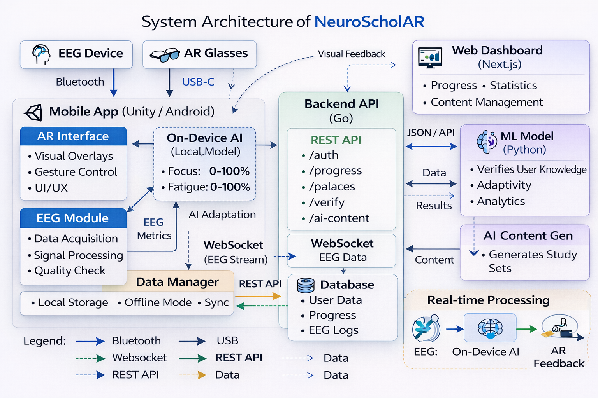

# System Architecture

## Overview
NeuroScholAR follows a hybrid architecture combining on-device processing for real-time AR/EEG with cloud services for data persistence and advanced ML. The system is designed with offline-first capabilities and focuses on low-latency EEG processing.

## Architecture Diagram

*For a high-level visual representation, see the diagram above.*

## Component Description

### Hardware Layer

| Component | Purpose | Connectivity |
|-----------|---------|--------------|
| **EEG Headband** (Muse/Emotiv) | Captures brain activity (raw EEG signals) | Bluetooth 5.0 |
| **AR Glasses** (Magic Leap/HoloLens) | Displays virtual objects in real space | USB-C/WiFi |
| **XREAL Beam Pro** | Computing unit running Unity app | USB-C to glasses |

### Unity Application (Mobile/AR)

The core application running on the XREAL Beam Pro, responsible for:

| Module | Responsibility |
|--------|----------------|
| **EEG Module** | Raw data acquisition, filtering (0.5-50Hz bandpass, 50/60Hz notch), signal quality monitoring |
| **Local TF Lite Model** | Real-time focus/fatigue detection (0-100% scores) from x-second EEG windows |
| **AR Module** | Object placement in space, gesture recognition, adaptive UI based on focus level |
| **Local Storage (SQLite)** | Offline persistence: memory palaces, flashcards, progress, session history |
| **Sync Manager** | Queues changes when offline, syncs with backend when connection restored |

### Backend Services

#### API Gateway (Go)
- REST API for web/mobile clients
- WebSocket server for live dashboard updates
- JWT authentication
- Request validation and rate limiting

### Web Dashboard (React)
- Progress statistics and visualizations
- Memory palace management
- EEG data charts (live via WebSocket)
- Custom data upload
- Performance reports generation

## Data Flow

### EEG Processing Pipeline (Real-time)
EEG Headband → Bluetooth → Unity EEG Module → Filtering →
Feature Extraction (4s window) → Local TF Lite Model →
Focus Level (0-100%) → AR UI Adaptation

### Learning Session Flow
User starts session → Load palace from local storage →
EEG monitoring begins → Adaptive UI based on focus →
User interacts with flashcards → Progress tracked locally →
Sync to backend when online → Dashboard updates

### Data Synchronization
Offline Mode:
Unity App → Local SQLite → Queue changes

Online Mode:
Unity App → Sync Manager → API Gateway → PostgreSQL
Web Dashboard ← WebSocket ← API Gateway (live updates)

## Communication Protocols

| Connection | Protocol | Data Format | Frequency |
|------------|----------|-------------|-----------|
| EEG → Unity | Bluetooth | Binary (custom) | 256 Hz |
| Unity → Backend | HTTPS/WSS | JSON | On change / 5s |
| Backend → Dashboard | WebSocket | JSON | Real-time |
| Backend → ML Service | HTTP/gRPC | JSON/Protobuf | On demand |

## Key Design Decisions

### Offline-First Architecture
- All core functionality works without internet
- Local SQLite with sync queue
- Conflict resolution using timestamps

### Edge ML Processing
- TF Lite models run on device for low latency
- Only aggregated data sent to cloud
- Privacy-preserving by design

### Microservices with Go
- Excellent concurrency for WebSocket connections
- Fast compilation and deployment
- Small memory footprint

## Performance Requirements

| Metric | Target |
|--------|--------|
| EEG inference latency | < 100ms |
| AR rendering | 30 FPS |
| Palace load time (25 objects) | < 7s |
| Sync latency (online) | < 2s |
| Model accuracy (focus) | > 75% |

## Security Considerations

- All data encrypted in transit
- JWT tokens with short expiration
- EEG data anonymized before cloud storage